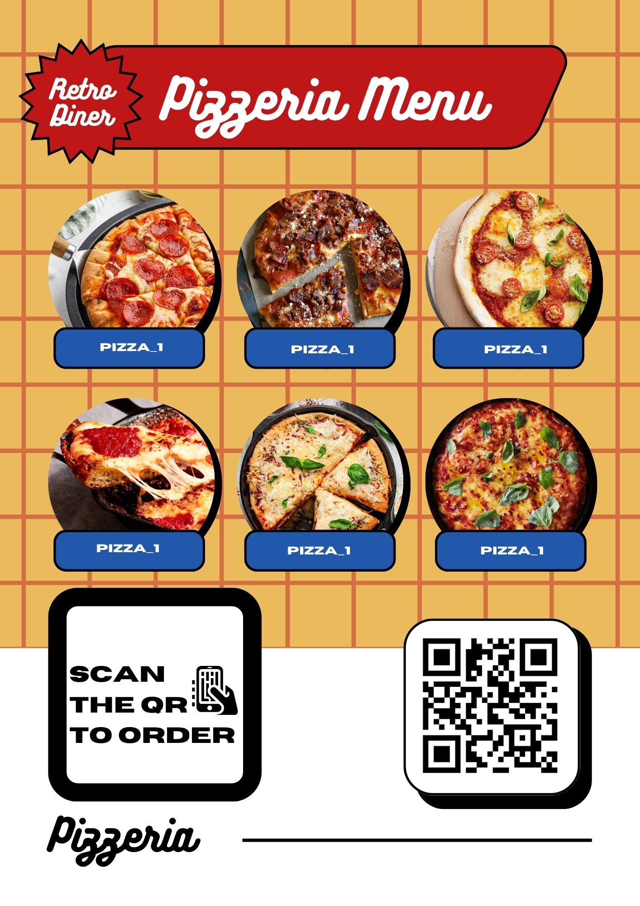

# 🍕 3D Interactive AR Pizzeria Menu

An Augmented Reality (AR) web application that brings a standard paper menu to life. Users can scan a flyer to view mouth-watering 3D models of pizzas, check prices, and generate a bill with tax calculations in real-time.

**🔗 [Try the Live Demo Here](https://agneya-1402.github.io/Pizzeria_3D-Menu/)**

---

## 📱 How to Use
1. **Open the App:** Click the [Live Demo Link](https://agneya-1402.github.io/Pizzeria_3D-Menu/) on your mobile phone.
2. **Allow Camera:** Grant camera permissions when prompted.
3. **Scan the Marker:** Point your camera at the image below (or your printed flyer).
4. **Interact:**
   - Use **Arrow Buttons** to switch between pizzas.
   - Click **Add to Order** to build your cart.
   - Click the **Cart Button (🛒)** to view your final bill with GST breakdown.

### 🎯 The Marker
*(Scan this image to see the AR Magic!)*


> *Note: Ensure the entire black square border is visible in the camera frame.*

---

## ✨ Key Features
* **Marker-based AR:** Uses lightweight tracking to anchor 3D content to a physical flyer.
* **Interactive Menu:** seamlessly cycle through 12 different pizza varieties.
* **Real-time Billing:** Dynamic cart system that calculates Subtotal, CGST (9%), SGST (9%), and Grand Total.
* **Zero App Install:** Runs entirely in the browser using WebAR technology.
* **Optimized Assets:** High-quality 3D models compressed for fast web loading.

---

## 🛠️ Tech Stack
* **Framework:** [A-Frame](https://aframe.io/) (VR/AR framework for HTML)
* **AR Engine:** [AR.js](https://ar-js-org.github.io/AR.js-Docs/) (Marker-based tracking)
* **Modeling:** Blender (for separating and optimizing GLB assets)
* **Languages:** HTML5, CSS3, JavaScript (ES6)

---

## 📂 Project Structure
```text
/
├── index.html          # Main application logic
├── marker.patt         # The AR tracking pattern file
├── Menu.jpg            # The physical flyer design
└── assets/
    └── pizzas/         # 3D Models (GLB Binary)
        ├── margherita_1.glb
        ├── pepperoni_1.glb
        └── ...